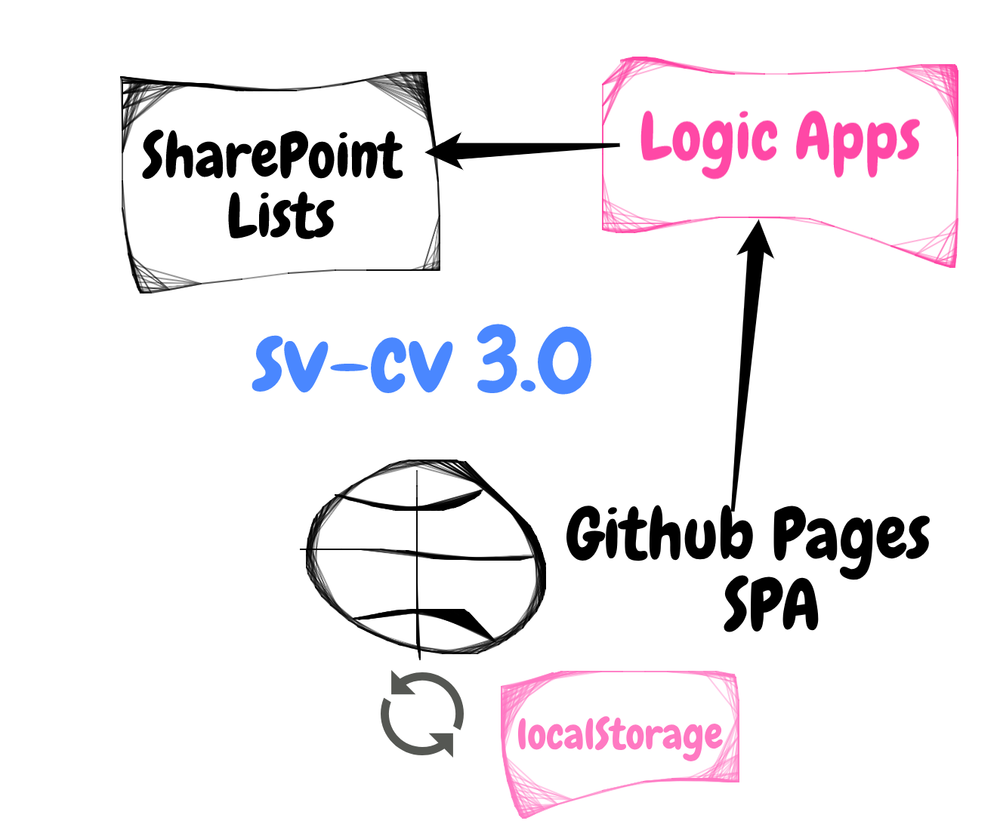
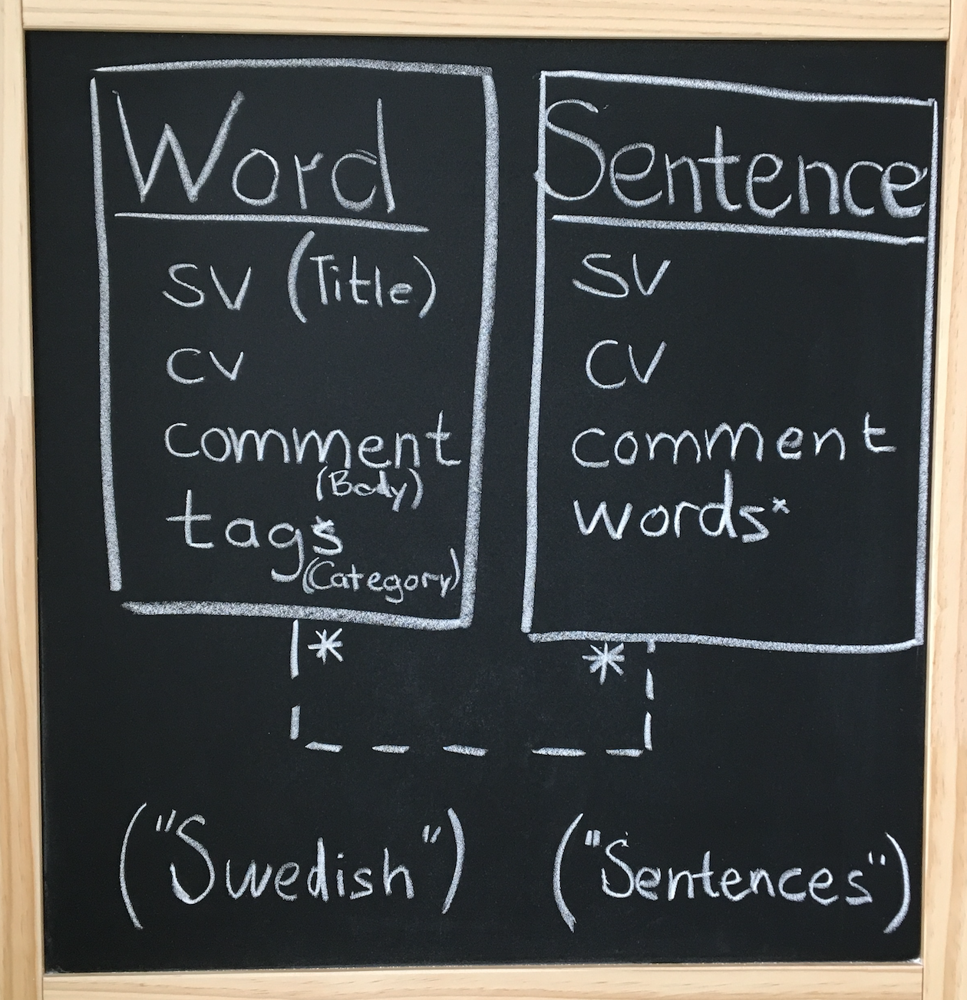

## sv-cv 3.0

I still think using SharePoint lists is okay as the data source because: 
1. It provides an edit interface, I don't need to develop and maintain this. Since I alreday have an Office 365 Developer Subscription, there is no additional cost.
2. It is flexible. I can add new columns, connect them, enable versioning, I also can invite contributors. 
3. It has a rich ecosystem: PowerApps, Flow, Azure etc. 

The public website is still a static site: Github Pages. It will remain a static site. Pros of Github Pages:
1. It provides free hosting for a static site.
2. It is an open repository for people to contribute
3. It sets up a free Letsencrypt certificate for SSL. 

The aim for sv-cv 3.0 is to automate fetching of words and sentences, so there is no delay because of the need of manual step. 



## sv-cv 2.0 (current version)

The main change for 2.0 is a shift from word focus to the sentence focus. The original list **Swedish** remains. Its field **Body** degrades to be only used for minor comments. A new list (table) is introduced: **Sentences**. Sentences are pairs of Swedish and Chuvash sentences. 

Why sentences? Even in version 1.0 there were example sentences, but they were in one field - Body. It makes it hard extract. Sometimes, the same sentence is a good example for more than one word entry in the dictionary. It is better to an own Entity for sentences and a loose many-to-many relationship to the Word entity. 

Machine translators use sentences for finding the translations. [Glosbe](https://glosbe.com/sv/cv/) has a totally machine created Swedish-Chuvash dictionary. The main part of the translated word come from the Bible Thesaurus. One of the goals to focus on sentences is to provide that work to other services like Glosbe, that can pick up the translations and make it available online in a bigger context and even make the reverse translation and new language pairs. 

Sentence
* Title (unused, remove)
* **sv** Swedish translation of one or more sentences.
* **cv** Chuvash translation of one or more sentences.
* **words** important words used in the sentence, Swedish, comma separated. In that way the sentences are loosely coupled to the words. It is then possible to assemble a dictionary with word entries and example sentences.
* **source** where the Chuvash sentence comes from. e.g. Ҫамрӑксен хаҫачӗ, 2018-03-07, p9. A separate system for abbreviations should be developed. 

It is important to mention that a Sentence is not always a grammatical sentence. It can be more than one sentence, if it makes a logical entity. Chuvash sentences can have exclamation marks inside a sentence. Citation can mean that periods, exclamation marks, and question marks can appear in the middle of a sentence. Do not rely on punctuation. That is one of the main reasons why Sentences must be focused on and they must have an own entity in the data model.



### Migration 1.0 -> 2.0

No particular migration will be done. The examples in the entries that are updated, can be moved to the *Sentences* table.

## sv-cv 1.0 (current version)

The data is entered in a SharePoint list called [**Swedish**](https://takana14.sharepoint.com/sites/pa/Lists/Swedish) (*private link*). The words are entered in the web interface and through the PowerApps. Then the words are extracted manually to a simple json formatted file put in the [```gh-pages```](https://github.com/mirontoli/sv-cv/tree/gh-pages) branch and presented on a Single Page Application hosted on Github Pages: [sv.chuvash.eu](http://sv.chuvash.eu/). 

The dictionary site is built with ReactJS, has a simple filtering capability and two modes: 

* regular mode (surfers' mode)
* kiosk mode (one entry that is changed at given interval, intended for screens on a wall)

The data is a plain list in SharePoint, containing following fields:

* **Title** for Swedish word
* **cv** for Chuvash translation
* **Body** for comments and example sentences and their translations
* **Category** for categorization like Flora, Fauna, Glue word... It is not populated to the public site yet.